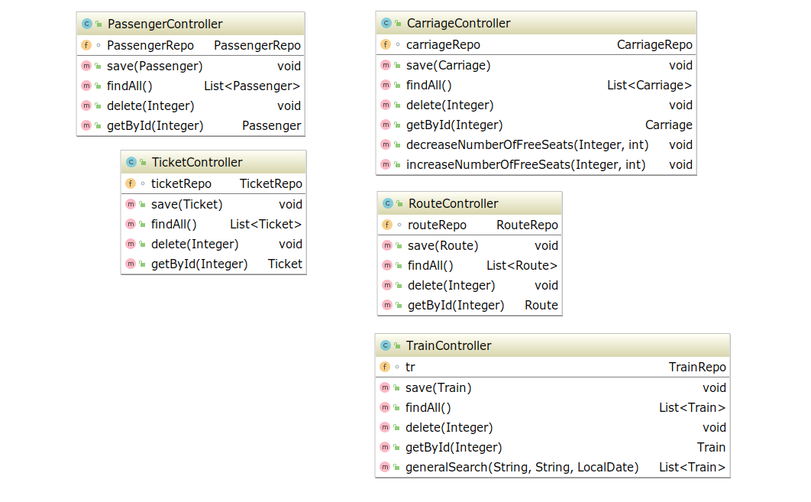

**RAILWAY BOOKING OFFICE - the console crud application**

This crud application emulates railway booking office.

You could work as admin(to create new train/carriage/route) or as client(to search/buy/return ticket).

***Layers:***
* model - POJO classes;
* repository - classes that implement access to .csv files;
* controller - processing requests from the user;
* view - all data necessary for working with the console.

For run application you should use Main class.

##### **Model:**

##### **Repository:**

##### **Controller:**

##### **View:**

